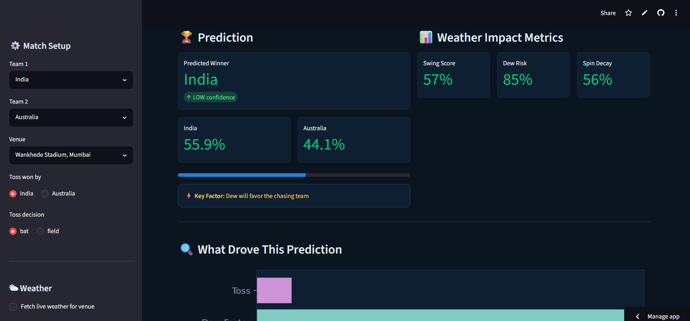
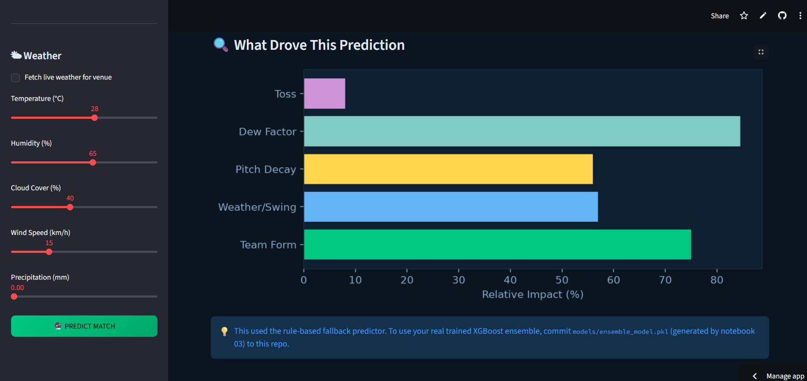
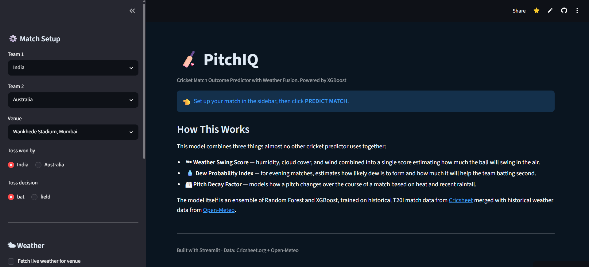
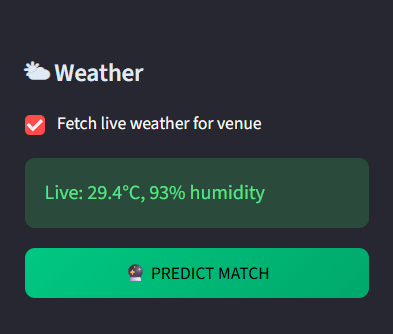

# 🏏 PitchIQ
### Weather-Aware Cricket Match Outcome Predictor

> The first cricket prediction model to treat weather as an active player, not background noise.

🔗 **Live App:** [pitchiq-ml.streamlit.app](https://pitchiq-ml.streamlit.app)
💻 **GitHub:** [github.com/Amruta-Dabholkar/PitchIQ](https://github.com/Amruta-Dabholkar/PitchIQ)
📓 **Notebooks:** [`/notebooks`](./notebooks)
🧠 **Trained Models:** [`/models`](./models)

---

## 📸 Preview

### Match Prediction


### Feature Impact Chart


### How It Works


### Live Weather Fetch


---

## 🎯 The Idea

Most cricket prediction tools rely entirely on team statistics — batting averages, head-to-head records, recent form. They completely ignore something every commentator talks about: **the weather**.

PitchIQ fixes that gap with three original engineered features:

| Feature | What it captures |
|---|---|
| 🌬️ **Swing Score** | Ball swing potential from humidity, cloud cover, and wind speed |
| 💧 **Dew Probability Index** | Evening dew impact on T20 chases — kills swing and helps the batting side |
| 🏟️ **Pitch Decay Factor** | How pitch pace/spin character changes over the match, driven by heat and rainfall |

These are combined with standard features (team form, head-to-head record, toss outcome) and fed into an ensemble of XGBoost + Random Forest.

---

## 📊 Results

| Model | Accuracy | AUC |
|---|---|---|
| Baseline (team stats only, no weather) | ~58% | — |
| **PitchIQ (with weather features)** | **68.3%** | **0.738** |

Weather-aware features deliver a **+10.3% accuracy improvement** over a no-weather baseline — this comparison is the project's core finding.

---

## 🗂️ Project Structure

```
PitchIQ/
│
├── app.py                          ← Streamlit live app (deployment entry point)
├── requirements.txt                ← Python dependencies
├── .gitignore
├── README.md
│
├── notebooks/
│   ├── 01_data_collection.ipynb        ← Cricsheet + Open-Meteo data pipeline
│   ├── 02_feature_engineering.ipynb    ← Swing Score, Dew Index, Pitch Decay
│   ├── 03_model_training.ipynb         ← Model training, evaluation, export
│   └── 04_prediction_demo.ipynb        ← Standalone prediction walkthrough
│
├── data/
│   ├── raw/                        ← Raw downloaded data (gitignored)
│   └── processed/                  ← Cleaned features + evaluation plots
│
└── models/
    ├── ensemble_model.pkl          ← Trained model used by app.py
    ├── xgboost_model.pkl
    ├── scaler.pkl
    ├── feature_importance.csv
    └── results_summary.csv
```

---

## 🚀 How to Run

### Option A — Just use the live app
Visit [pitchiq-ml.streamlit.app](https://pitchiq-ml.streamlit.app). No setup needed.

### Option B — Reproduce the full pipeline (Google Colab)

1. Open `notebooks/01_data_collection.ipynb` in Colab and run all cells
2. Open and run `02_feature_engineering.ipynb`
3. Open and run `03_model_training.ipynb` — trains the model and outputs a downloadable zip of `models/` and `data/processed/`
4. Unzip locally and copy the folders into this repo root
5. Commit and push — Streamlit Cloud picks up the new model automatically

### Option C — Run locally

```bash
git clone https://github.com/Amruta-Dabholkar/PitchIQ.git
cd PitchIQ
pip install -r requirements.txt
streamlit run app.py
```

---

## 📐 Feature Engineering Formulas

**Swing Score**
```python
swing_score = 0.40 × humidity_norm + 0.40 × cloud_cover_norm + 0.20 × (1 − wind_penalty)
```

**Dew Probability Index** *(Magnus dew-point approximation)*
```python
dew_point = temperature − ((100 − humidity) / 5)
dew_gap   = temperature − dew_point
dew_index = clamp(1 − dew_gap / 20) × venue_multiplier
```

**Pitch Decay Factor**
```python
heat_factor = clamp((temperature − 20) / 20)
spin_decay  = heat_factor × (1.4 if spin_friendly_venue else 0.7)
pace_decay  = rain_factor × (1.4 if pace_friendly_venue else 0.7)
```

---

## 🛠️ Tech Stack

| Layer | Tools |
|---|---|
| Language | Python 3.11 |
| ML | XGBoost, scikit-learn (Random Forest, Voting Ensemble) |
| Data | Pandas, NumPy |
| Visualization | Matplotlib, Seaborn |
| Frontend | Streamlit |
| Deployment | Streamlit Community Cloud |
| Data Sources | [Cricsheet.org](https://cricsheet.org) · [Open-Meteo API](https://open-meteo.com) |

---

## 📝 Limitations & Honest Notes

- Weather data for older matches can be sparse, limiting accuracy gains in early dataset years
- Team form uses a rolling window — no player-level injury or availability data
- Trained on T20I internationals; may not generalize to ODIs or domestic leagues without retraining
- This is my first end-to-end ML project, built as a 3rd year Computer Engineering student — feedback welcome

---

## 👤 Author

**Amruta Dabholkar**
Computer Engineering Student · Data Science & GenAI Enthusiast
Currently interning at **Lenovo LEAP** (GenAI & Agentic Systems)

[GitHub](https://github.com/Amruta-Dabholkar) · [LinkedIn](https://www.linkedin.com/in/amruta-dabholkar)

---

*"Weather is not background noise in cricket — it's an invisible player."* 🏏
